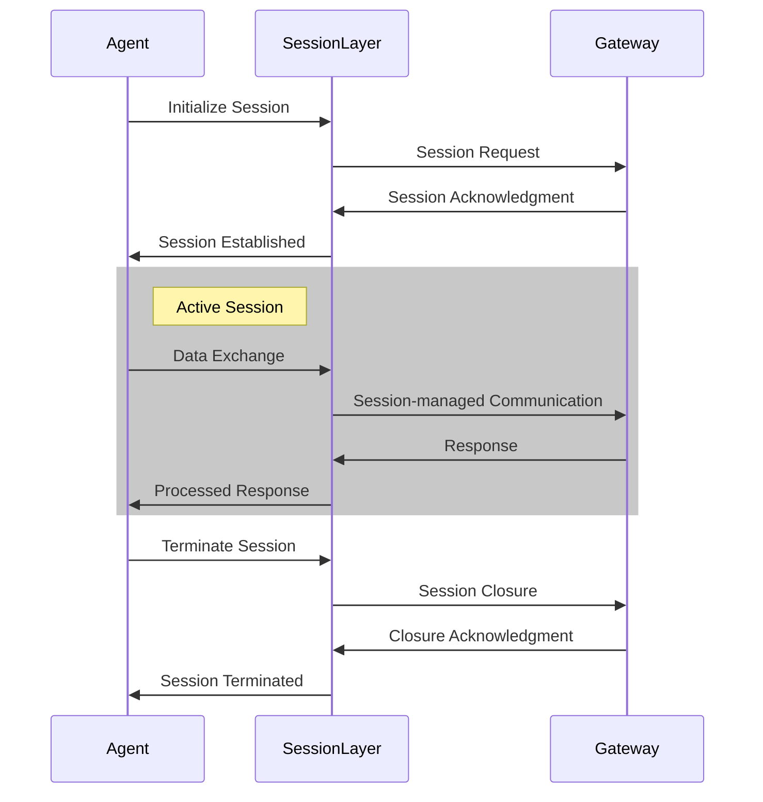

# Session Layer

The AGP (Agent Gateway Protocol) Session Layer manages and maintains the communication state between agents and their respective gateways. It provides essential services for establishing, maintaining, and terminating sessions between communicating entities in the AGP ecosystem.

## Flow Diagram

## Key Features

- **Session Establishment**: Handles the initial handshake and connection setup
- **State Management**: Maintains session context and state information
- **Security**: Implements session-level security measures and token management
- **Error Recovery**: Provides mechanisms for handling session interruptions and failures
- **Session Termination**: Manages graceful session closure and cleanup

## Architecture

The session layer operates between the transport and presentation layers, providing a reliable communication framework for higher-level protocol operations. It ensures:

1. Secure session initialization
2. Stateful communication
3. Error handling and recovery
4. Graceful session termination