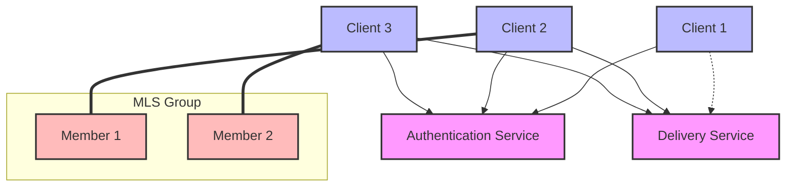

# Core Concepts

Multi-agent software incorporates complex design patterns inherited from various
established frameworks:

- Machine learning
- Cloud-native computing
- Interactive real-time applications
- Big data processing

LLMs (Large Language Models) and agent frameworks serve as middleware that
automates processes traditionally requiring human intervention. This integration
layer connects diverse systems and enables new automation capabilities through:

- Natural language processing
- Contextual understanding
- Task decomposition
- Autonomous decision making

By integrating these technologies, multi-agent systems can manage complex
workflows while ensuring:

- Cloud-native scalability
- Real-time responsiveness
- Large-scale data processing
- Seamless ML model integration

## Main Components

Interconnecting these systems at scale requires meeting strict latency and
response time requirements. AGP aims to provide a secure, scalable, and
user-friendly communication framework that unifies state-of-the-art capabilities
from all mentioned frameworks into a single implementation.

The main components of AGP are:

- Data plane
- Session layer
- Control plane
- Security layer.

