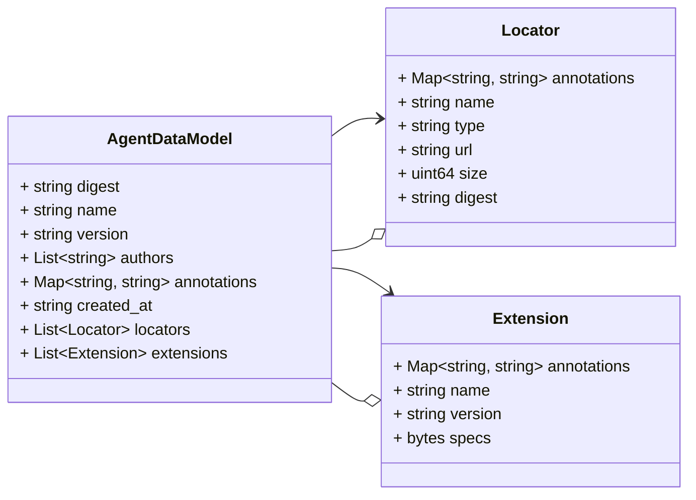
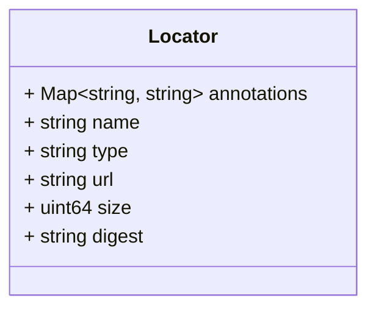
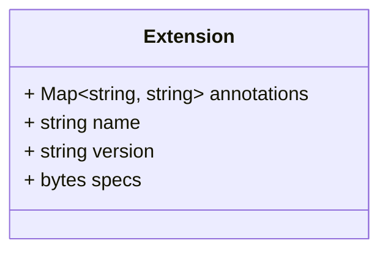

# Package: schema.model

SPDX-FileCopyrightText: Copyright (c) 2025 Cisco and/or its affiliates. SPDX-License-Identifier: Apache-2.0 

## Imports

| Import | Description |
|--------|-------------|

## Options

| Name | Value | Description |
|------|-------|-------------|

### AgentDataModel Diagram

## Message: AgentDataModel

FQN: schema.model.AgentDataModel

The data model defines a schema for AI agent content representation. The schema provides a way to describe agent's features, constraints, artifact locators, versioning, ownership, or relevant details. 

| Field       | Ordinal | Type           | Label    | Description                                                                                       |
|-------------|---------|----------------|----------|---------------------------------------------------------------------------------------------------|
| digest      | 1       | string         |          | Digest defines complete content fingerprint. It can be used as a globally-unique ID of an Agent.  |
| name        | 2       | string         |          | Name of the agent                                                                                 |
| version     | 3       | string         |          | Version of the agent                                                                              |
| authors     | 4       | string         | Repeated | List of agent’s authors in the form of `author-name <author-email>`                             |
| annotations | 5       | string, string | Map      | Additional metadata associated with this agent                                                    |
| created_at  | 6       | string         |          | Timestamp of the agent creation time                                                              |
| locators    | 7       | Locator        | Repeated | List of source locators where this agent can be found or used from                                |
| extensions  | 8       | Extension      | Repeated | List of extensions that describe this agent and its capabilities more in depth                    |

### Locator Diagram

### Extension Diagram

## Message: Locator

FQN: schema.model.AgentDataModel.Locator

Locators provide actual artifact locators of an agent. For example, this can reference sources such as helm charts, docker images, binaries, etc. 

| Field       | Ordinal | Type           | Label | Description                                                        |
|-------------|---------|----------------|-------|--------------------------------------------------------------------|
| annotations | 1       | string, string | Map   | Metadata associated with this source locator                       |
| name        | 2       | string         |       | Name of the source locator for this agent                          |
| type        | 3       | string         |       | Type of the source locator, e.g. `docker-image, helm-chart`        |
| url         | 4       | string         |       | Location URI where this source locator can be found                |
| size        | 5       | uint64         |       | Size in bytes of the source locator pointed by the `url` property  |
| digest      | 6       | string         |       | Digest of the source locator pointed by the `url` property         |

## Message: Extension

FQN: schema.model.AgentDataModel.Extension

Extensions provide dynamic descriptors for an agent. For example, security and categorization features can be described using extensions. 

| Field       | Ordinal | Type           | Label | Description                                                                              |
|-------------|---------|----------------|-------|------------------------------------------------------------------------------------------|
| annotations | 1       | string, string | Map   | Metadata associated with this extension                                                  |
| name        | 2       | string         |       | Name of the extension attached to this agent                                             |
| version     | 3       | string         |       | Version of the extension attached to this agent                                          |
| specs       | 4       | bytes          |       | Generic specification schema of this extension. Value of this property is JSON-encoded.  |

<!-- Created by: Proto Diagram Tool -->
<!-- https://github.com/GoogleCloudPlatform/proto-gen-md-diagrams -->
