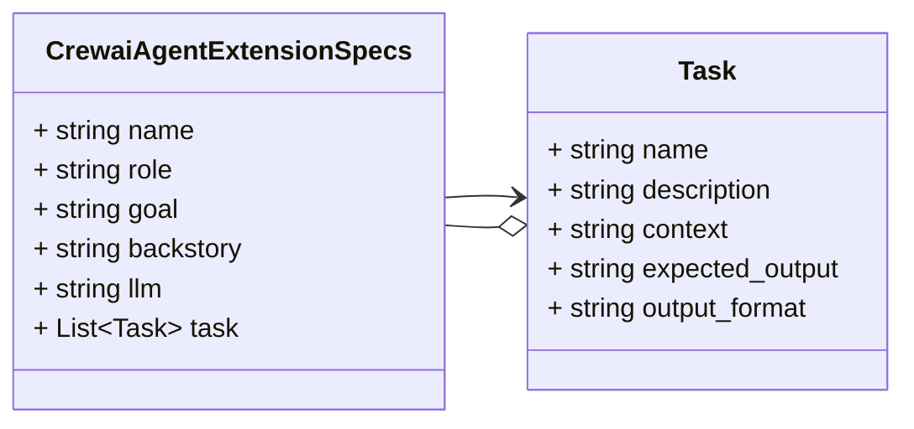
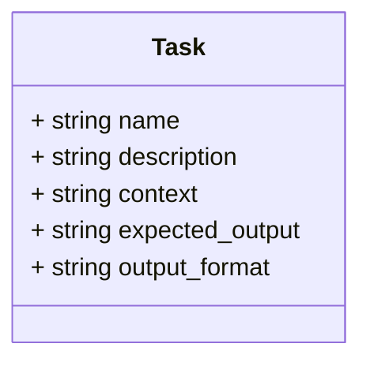

# Package: schema.model.crewai

SPDX-FileCopyrightText: Copyright (c) 2025 Cisco and/or its affiliates. SPDX-License-Identifier: Apache-2.0 

## Imports

| Import | Description |
|--------|-------------|

## Options

| Name | Value | Description |
|------|-------|-------------|

### CrewaiAgentExtensionSpecs Diagram

## Message: CrewaiAgentExtensionSpecs

FQN: schema.model.crewai.CrewaiAgentExtensionSpecs

CrewaiAgentExtensionSpecs defines an extension schema that encodes CrewAI agent information. 

| Field     | Ordinal | Type   | Label    | Description |
|-----------|---------|--------|----------|-------------|
| name      | 1       | string |          |             |
| role      | 2       | string |          |             |
| goal      | 3       | string |          |             |
| backstory | 4       | string |          |             |
| llm       | 5       | string |          |             |
| task      | 6       | Task   | Repeated |             |

### Task Diagram

## Message: Task

FQN: schema.model.crewai.CrewaiAgentExtensionSpecs.Task

Basic information about CrewAI agent tasks. 

| Field           | Ordinal | Type   | Label | Description |
|-----------------|---------|--------|-------|-------------|
| name            | 1       | string |       |             |
| description     | 2       | string |       |             |
| context         | 3       | string |       |             |
| expected_output | 4       | string |       |             |
| output_format   | 5       | string |       |             |

<!-- Created by: Proto Diagram Tool -->
<!-- https://github.com/GoogleCloudPlatform/proto-gen-md-diagrams -->
