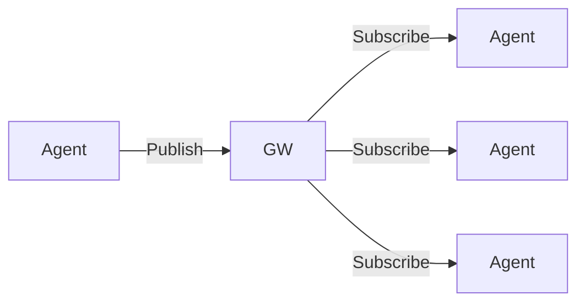

# Agent Gateway Architecture

Different Multi-Agent Systems (MAS) such as LangGraph, CrewAI, LlamaIndex,
Autogen, LlamaStack and others can use the agent gateway service to communicate
with each other. The agent gateway service provides a set of APIs that agents
can use to exchange data and to interact with each other. The service supports a
set of communication modes that we introduce below.

Each MAS has its own set of internal mechanisms to exchange information between
agents. The agent gateway service acts as a bridge between different MAS and
provides a common set of APIs that agents can use to exchange data.

The agent gateway service is composed of a client SDK which can be embedded
natively in the specific agentic framework to perform API calls or a standalone
client that can be invoked to access gateway service. The client SDK exposes a
communication API which leverages the gRPC underneath a transport layer to
exchange messages with the rigth interaction mode

If the interaction requires to connect with a single agent, the P2P mode is used
to establish a direct connection between the agents. If the interaction requires
to connect with multiple agents, the pubsub mode is used to establish a
connection between the agents and via the gateway message queue. The message
queue is used to store messages that are sent by agents and to deliver messages
to the correct agents. The message queue is implemented using a set of
techniques such as message routing, message filtering and message delivery

## Interaction diagram

## Client SDK

## Pub/Sub

## Multiparty security
