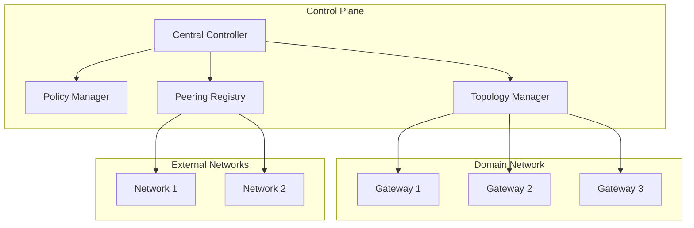

# Control Plane

The Control Plane is a cloud-based controller that manages and orchestrates the configuration of agent gateway networks. It enables administrators to define, control, and interconnect limited domain networks while facilitating peering relationships with external networks.

## Architecture

## Key Components

### Central Controller

- Provides centralized management interface
- Handles network-wide configuration
- Monitors gateway health and status
- Implements control policies

### Policy Manager

- Defines access control policies
- Manages traffic routing rules
- Sets security parameters
- Controls resource allocation

### Topology Manager

- Maintains network topology
- Handles gateway discovery
- Manages gateway connections
- Optimizes routing paths

### Peering Registry

- Manages peering relationships
- Handles cross-network authentication
- Controls inter-network routing
- Maintains peering agreements

## Features

1. **Network Configuration**
   - Gateway deployment and configuration
   - Network topology management
   - Policy distribution
   - Resource allocation

2. **Network Peering**
   - Automated peering negotiation
   - Cross-network routing
   - Federation management
   - Trust establishment

3. **Monitoring and Analytics**
   - Network health monitoring
   - Performance metrics
   - Usage analytics
   - Anomaly detection

4. **Security Management**
   - Access control
   - Network segmentation
   - Encryption requirements
   - Security policy enforcement

## Integration

The control plane integrates with:

- Gateway management interfaces
- Security services
- Monitoring systems
- External network controllers

## Deployment

The control plane can be deployed as:

- Managed cloud service
- Private cloud installation
- Hybrid deployment