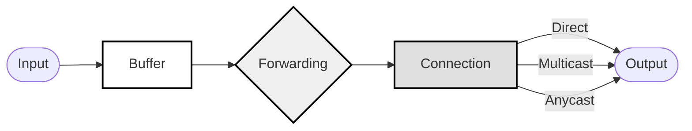

# Data Plane

The Agent Gateway Protocol (AGP) data plane implements an efficient message routing and delivery system between agents.

## Message Format

AGP messages use a channel-based addressing scheme for content routing:

```protobuf
message AgpMessage {
    string channel_id = 1;
    string message_id = 2;
    bytes payload = 3;
    MessageMetadata metadata = 4;
}
```

## Connection Table

The connection table maintains agent connectivity information by mapping channel IDs to connected agents and tracking connection state and capabilities.

## Forwarding Table

The forwarding table implements intelligent message routing by implementing the following:

- Maps message patterns to delivery strategies.
- Supports content-based routing.
- Maintains routing metrics and preferences.
- Handles multicast and anycast delivery.

## Message Buffer

The message buffer provides temporary storage by implementing the following:

- Caches messages for reliable delivery.
- Implements store-and-forward when needed.
- Supports message deduplication.
- Handles out-of-order delivery.

## Data Plane Flow



The diagram shows the message flow through the AGP data plane components:

1. Messages enter the system and are processed by the Message Buffer.
2. The Message Buffer handles deduplication and store-and-forward.
3. The Forwarding Table determines routing strategy.
4. The Connection Table manages delivery to connected agents.
5. Messages are delivered through direct, multicast, or anycast methods.