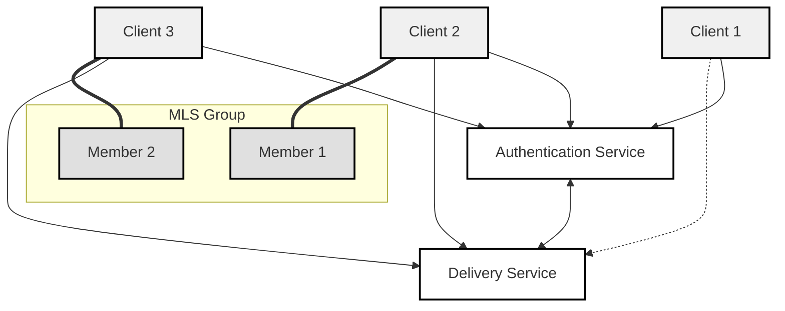

# Security Layer

The Security Layer implements secure group communications using the Message Layer Security (MLS) protocol. This layer ensures end-to-end encryption, authentication, and access control across agent groups within the AGP ecosystem.

## Overview

The security layer leverages MLS to provide:

- Quantum-safe end-to-end encryption (QSE2EE) for group communications
- Dynamic group membership management
- Forward secrecy and post-compromise security
- Scalable key management for large agent groups

## Key Components

### 1. Group State Management

- Maintains cryptographic group state
- Handles member additions and removals
- Manages group epoch changes
- Processes key updates

### 2. Key Schedule

- Derives encryption keys from group secrets
- Implements MLS key schedule
- Manages key rotations
- Ensures forward secrecy

### 3. Message Protection

- Encrypts group messages
- Provides integrity protection
- Implements sender authentication
- Handles message sequencing

### 4. Authentication

- Validates group members
- Verifies message signatures
- Manages identity credentials
- Implements access control

## Security Properties

- **Forward Secrecy**: Ensures past communications remain secure if keys are compromised
- **Post-Compromise Security**: Provides security guarantees after member compromise
- **Group Authentication**: Verifies message origin within the group
- **Message Confidentiality**: Protects message content from unauthorized access

## Integration

The security layer integrates with:

- Transport layer for secure message delivery
- Session layer for maintaining secure contexts
- Identity services for credential management

