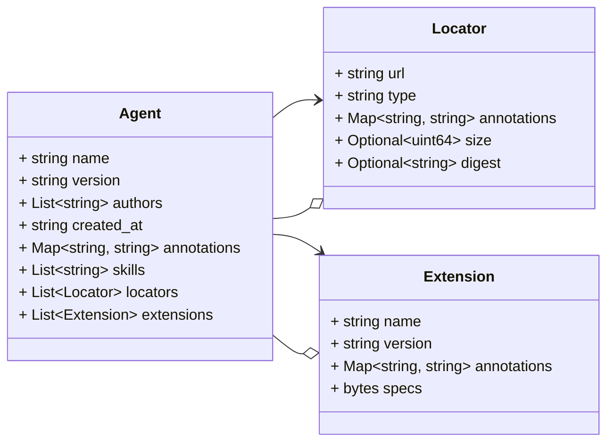
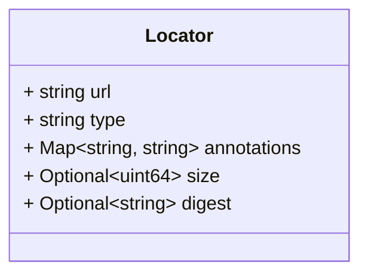
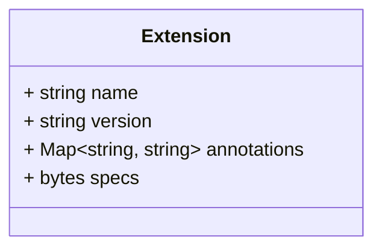

# Package: schema.model

 

## Imports

| Import | Description |
|--------|-------------|

## Options

| Name | Value | Description |
|------|-------|-------------|

### Agent Diagram

## Message: Agent

FQN: schema.model.Agent

The data model defines a schema for AI agent content representation. The schema provides a way to describe agent's features, constraints, artifact locators, versioning, ownership, or relevant details. 

| Field       | Ordinal | Type           | Label    | Description                                                                                                |
|-------------|---------|----------------|----------|------------------------------------------------------------------------------------------------------------|
| name        | 1       | string         |          | Name of the agent.                                                                                         |
| version     | 2       | string         |          | Version of the agent.                                                                                      |
| authors     | 3       | string         | Repeated | List of agent’s authors in the form of `author-name <author-email>`.                                     |
| created_at  | 4       | string         |          | Creation timestamp of the agent in the RFC3339 format. Specs: https://www.rfc-editor.org/rfc/rfc3339.html  |
| annotations | 5       | string, string | Map      | Additional metadata associated with this agent.                                                            |
| skills      | 6       | string         | Repeated | List of skills that this agent is capable of performing. Specs: https://schema.oasf.agntcy.org/skills      |
| locators    | 7       | Locator        | Repeated | List of source locators where this agent can be found or used from.                                        |
| extensions  | 8       | Extension      | Repeated | List of extensions that describe this agent more in depth.                                                 |

### Locator Diagram

### Extension Diagram

## Message: Locator

FQN: schema.model.Agent.Locator

Locators provide actual artifact locators of an agent. For example, this can reference sources such as helm charts, docker images, binaries, etc. 

| Field       | Ordinal | Type           | Label    | Description                                                                        |
|-------------|---------|----------------|----------|------------------------------------------------------------------------------------|
| url         | 1       | string         |          | Location URI where this source locator can be found.                               |
| type        | 2       | string         |          | Type of the source locator, for example: "docker-image", "binary", "source-code".  |
| annotations | 3       | string, string | Map      | Metadata associated with this source locator.                                      |
| size        | 4       | uint64         | Optional | Size in bytes of the source locator pointed by the `url` property.                 |
| digest      | 5       | string         | Optional | Digest of the source locator pointed by the `url` property.                        |

## Message: Extension

FQN: schema.model.Agent.Extension

Extensions provide dynamic descriptors for an agent. For example, security and categorization features can be described using extensions. 

| Field       | Ordinal | Type           | Label | Description                                                                                   |
|-------------|---------|----------------|-------|-----------------------------------------------------------------------------------------------|
| name        | 1       | string         |       | Name of the extension.                                                                        |
| version     | 2       | string         |       | Version of the extension.                                                                     |
| annotations | 3       | string, string | Map   | Metadata associated with this extension.                                                      |
| specs       | 4       | bytes          |       | Value of the data, it is available directly or can be constructed by fetching from some URL.  |

<!-- Created by: Proto Diagram Tool -->
<!-- https://github.com/GoogleCloudPlatform/proto-gen-md-diagrams -->
